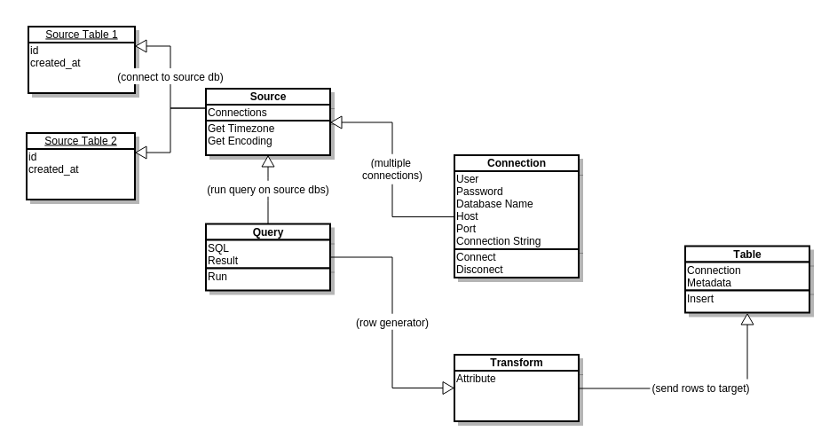

## Eazy-Etl

Simple functions to create a ETL pipeline.

Works with Python 3.


#### Setup Environment

1. Download this module somewhere you can reffer to it (ex. /home/user/pylib/eazy_etl/)
2. Add the folder to your python path, by appending .bashrc file:

    ```bash
    # open .bashrc
    nano /home/user/.bashrc

    # add this line at the end, save and exit
    export PYTHONPATH=~/pylib

    # restart bash, just type bash in terminal
    # now you should be able to import eazy_etl in python
    ```

3. Install requirements form the requirements.txt file:

    ```bash
    sudo pip install -r requirements.txt
    ```

That is pretty much it.


#### Google Docs

Follow [these](https://gspread.readthedocs.org/en/latest/oauth2.html)
steps in order to authorize __gspread__ to use your Google Drive API.

Get the client secrets .json file and save it in the ./configuration_files folder. Name it
'google_secrets.json' and that should do it.

Additionally you can modify the ./google_docs.py script to add more features.

#### Module Diagram

